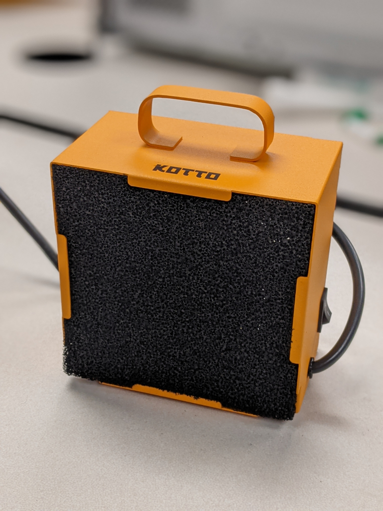

# Fume extractor

The fume extractor filters soldering fumes out of the air, and should be used at all times while soldering. Make sure that the fan is on, and the filter is facing the soldering iron while in use.

