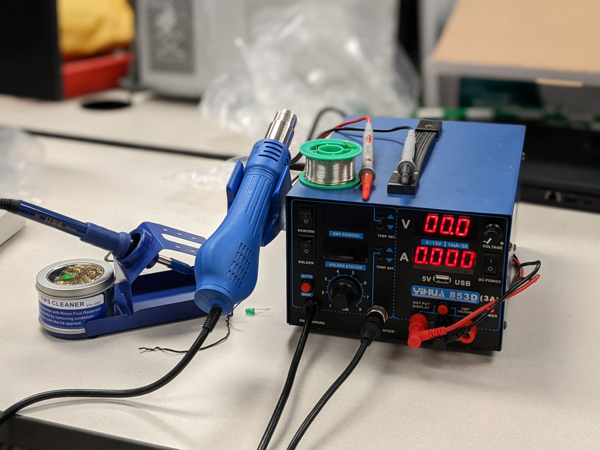

# Rework Station

The rework station can be used for various electronics projects. It also includes a soldering iron and multimeter. It it wall powered, and can be turned on via a rear power switch. If this is your first time using a soldering iron or rework station, please be careful to not touch the metal hot ends, as both tools heat very quickly, and often do not cool as quickly as the temperature indicators would suggest.

The station includes a variety of tips for the soldering iron and reflow gun, as well as various other accessories.

## Soldering

***Make sure to use a [fume extractor](fumeextractor.md) while soldering.***

To solder, turn on the solder switch, then adjust the temperature using the two buttons to the right of the solder station display. Make sure to clean the tip of the soldering iron when finished using the included cleaner.

### [Soldering tutorial](https://www.youtube.com/watch?v=oqV2xU1fee8)

## SMD Rework

The rework gun is turned on with the rework switch. Once it is on, make sure it isn't pointed at anything, as it will immediately begin blowing hot air. Temperature can be adjusted using the two buttons to the right of the SMD rework display. Fan speed can be adjusted by using the knob on the bottom.

When turning the reflow gun off, it will take 15-30 seconds to cool down depending on the fan speed.

## Multimeter

*The multimeter and 5v out are currently untested, however they should behave similarly to a normal multimeter.*